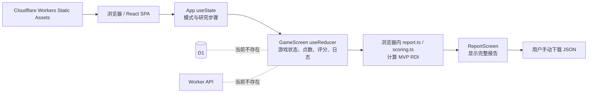
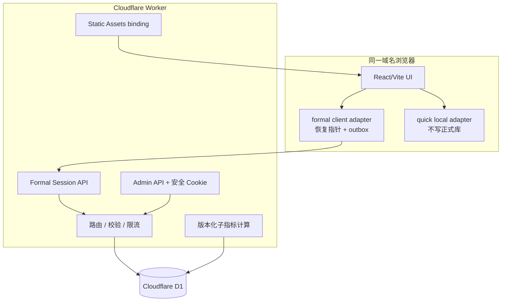

# Mind-Game 后端审计与 Cloudflare D1 分阶段实施计划

> 文档状态：阶段 0 审计结论，尚未开始 Worker API、D1 绑定或数据库迁移实施
> 审计日期：2026-07-31（Asia/Shanghai）
> 审计仓库：`https://github.com/eraser-1973/Mind-Game`
> 基准分支与提交：`origin/main` @ `b3b6bcc59d4e87fcb2942bb4436932544524b90e`
> 后续开发分支：`feature/cloudflare-d1-backend`
> 需求依据：《模拟招聘压力决策测评_后端开发任务说明与数据接口规范》及本轮已确认的 50 项约束

## 1. 审计边界与结论摘要

本阶段只完成仓库审计、需求核对、分支隔离和实施计划。没有修改游戏页面、候选人材料、评分逻辑、部署配置，没有创建数据库迁移，也没有添加 Worker/API 代码。

当前项目是 React 18 + TypeScript + Vite 6 的纯前端单页应用。`App` 的多个 `useState` 保存研究流程，`GameScreen` 内的 `useReducer` 保存一局游戏；Cloudflare 配置只负责发布 `dist/` 静态资源和 SPA 回退。当前不存在真正的 Worker API、D1、管理员后台、服务器权威状态、自动上传、刷新恢复或跨设备恢复。

现有 2D 游戏、候选人内容、5 点查证、T1—T3、计时、HR/Niko、沉没成本和 MVP 报告可以作为交互原型保留，但正式实验的数据权威边界必须迁往服务器。尤其是点数、证据解锁、阶段封存、倒计时、最终提交、版本绑定和派生指标，不能继续以浏览器 reducer 为最终事实来源。

## 2. 基线验证

所有命令均在从最新 `origin/main` 创建的独立干净工作树中执行。

| 命令 | 结果 | 记录 |
| --- | --- | --- |
| `npm install` | 通过 | 安装 106 个包；审计 107 个包。没有造成受跟踪文件变更。npm 同时报出 1 个 high 严重度的间接依赖公告。 |
| `npm test -- --run` | 通过 | Vitest 3.2.7；15 个测试文件、55 项测试全部通过，0 失败。 |
| `npm run typecheck` | 通过 | `tsc -b --pretty false` 无 TypeScript 错误。 |
| `npm run build` | 通过 | Vite 6.4.3；56 个模块；构建用时约 1 秒。 |

构建产物目录是仓库根目录的 `dist/`。本次产物包含 `dist/index.html`、一个 CSS bundle 和一个 JavaScript bundle。

`npm audit --json` 额外确认当前唯一高危项是 PostCSS `<=8.5.17` 的 source map 路径遍历公告（GHSA-r28c-9q8g-f849），属于间接依赖且有可用修复。本阶段不升级依赖；进入生产部署前应以单独变更评估并修复。

## 3. 当前架构与数据流



### 3.1 正式模式当前流程

`StartScreen` 选择正式模式后，`src/App.tsx:47-59` 创建匿名 `ResearchData`，随后按以下顺序执行：

1. 知情同意：`src/App.tsx:65-83`；
2. 匿名基本信息：`src/App.tsx:85-99`；
3. 测前状态：`src/App.tsx:101-117`；
4. 招聘决策游戏：`src/App.tsx:169-183`；
5. 测后状态：`src/App.tsx:119-134`；
6. 任务体验与压力操纵检验：`src/App.tsx:136-151`；
7. 浏览器生成并显示完整抗压报告：`src/App.tsx:153-166`。

当前没有姓名、学号、手机号登记页。当前知情同意书还明确承诺“不收集姓名、联系方式”，见 `src/data/researchFlow.ts:11-16` 和 `src/components/ConsentScreen.tsx:53-55`，与本轮新确定的身份登记要求冲突，后续必须先完成伦理文本和隐私告知的变更控制。

### 3.2 快速模式当前流程

快速模式跳过所有研究页面，直接进入 3 分钟游戏，游戏结束后直接显示完整报告并允许导出 JSON，见 `src/App.tsx:47-55`、`src/components/GameScreen.tsx:80-100`。快速模式还提供“推进到最后 1 分钟”的测试按钮，见 `src/components/GameScreen.tsx:190-202`。

### 3.3 当前状态位置与生命周期

| 数据 | 当前存放位置 | 生命周期与风险 |
| --- | --- | --- |
| 模式、研究步骤、问卷、已完成游戏状态 | `src/App.tsx:21-30` 的 React `useState` | 只在当前标签页内存中；刷新、崩溃、关闭页面即丢失。 |
| 游戏阶段、点数、候选人顺序、评分、证据、日志、聊天、最终选择 | `src/components/GameScreen.tsx:38-42` 的 `useReducer`，结构定义于 `src/types/game.ts:199-220` | 只在组件内存中；无本地持久化，无服务器副本。 |
| 候选人材料及后台答案 | `src/data/candidates.ts` | 被打包进公开 JavaScript bundle，可被查看和篡改。 |
| 报告与 RDI | `src/utils/report.ts`、`src/utils/scoring.ts` | 浏览器直接计算，输入和算法均可被修改。 |
| 导出数据 | `src/utils/researchData.ts:90-136` | 只在参与者电脑下载；研究者不会自动收到。 |

仓库内没有 `localStorage`、`sessionStorage`、IndexedDB、`fetch('/api/...')`、`sendBeacon` 或后台恢复实现。刷新会重新回到入口；关闭网页不会产生服务器可见的退出记录；换电脑无法恢复。

### 3.4 核心行为当前实现

1. **查证扣点**：`src/state/gameReducer.ts:264-353` 在浏览器 reducer 中检查 `availablePoints` 并直接减 1 或 3。对同一已解锁 bundle 的重复 reducer action 不再扣点，但没有跨请求幂等、并发控制或服务器账本。
2. **T1/T2/T3 评分**：保存在 `runtime[candidateId].ratings`，见 `src/state/gameReducer.ts:221-261`。UI 的 `nextStage` 会隐藏已提交阶段，见 `src/components/RatingPanel.tsx:14-20`，但 reducer 未拒绝再次提交同一阶段；任意 `RATE` action 都会覆盖原记录。因此“已封存”目前主要是 UI 约束，不是数据不可变约束。
3. **评分证据关联**：评分记录只有 `value` 与 `elapsedSec`，见 `src/types/game.ts:73-76`；没有提交前实际看过的 evidence ID 快照。
4. **最终录用**：点击候选人卡片立即触发 `FINAL_SELECT` 并进入报告，见 `src/components/FinalDecisionPanel.tsx:36-57` 与 `src/state/gameReducer.ts:399-416`。没有最终信心、二次确认、服务器提交，也无法区分 manual、timeout_confirmed、timeout_auto。
5. **沉没成本**：只保存枚举选择和一条文本日志，见 `src/state/gameReducer.ts:355-379`；没有触发对象、触发证据、选择时点状态及选择后的结构化行为链。
6. **计时**：`setInterval` 每秒派发 `TICK`，见 `src/components/GameScreen.tsx:45-52`。权威时间完全来自浏览器，刷新归零，后台无法验证暂停、系统休眠或人为修改。
7. **停留时间**：只在切换候选人或最终选择时结算，见 `src/state/gameReducer.ts:130-145`、`201-219`、`399-416`；页面直接关闭、刷新或未切换的最后一段可能漏记。
8. **候选人顺序**：`shuffleCandidateIds` 使用 Fisher–Yates，见 `src/utils/candidateOrder.ts:1-16`，一局内顺序保存在 state 并保持稳定。但默认打开者写死为 `candidates[0].id`，见 `src/state/gameReducer.ts:69-82`，因此列表首位随机后，默认仍固定打开 A，构成位置与首曝不一致。

### 3.5 当前 JSON 导出

`buildAnonymousResearchExport` 当前包含：schemaVersion、导出时间、匿名 participantId、同意记录、人口学信息、测前/测后、任务体验、模式、时长、候选人显示顺序、最终候选人、完整 runtime、日志、沉没成本选择、Niko 消息和报告指标。

同时它还导出最终候选人的 `trueAbility`、`trueFit`、`isToxic`，以及 ROI、策略、损失厌恶、MVP RDI，见 `src/utils/researchData.ts:103-131`。`ReportScreen` 为正式与快速模式都显示完整 RDI、韧性等级、岗位基准分、六维分和 JSON 按钮，见 `src/components/ReportScreen.tsx:51-132`、`187-246`。

## 4. 重点文件审计

| 文件/目录 | 当前职责 | 保留价值 | 后续迁移点 |
| --- | --- | --- | --- |
| `README.md` | 本地运行、快速流程、MVP RDI 说明 | 可保留开发入口 | 增加 Worker/D1、本地迁移、管理员与部署文档；删除正式模式依赖 JSON 的叙述。 |
| `package.json` | Vite/React/Vitest 脚本与依赖 | 现有 build/typecheck/test 脚本可保留 | 后续增加 Wrangler Worker 类型、迁移和 E2E/API 测试脚本；先处理 PostCSS 公告。 |
| `wrangler.jsonc` | 仅发布 `dist/`，SPA fallback | `assets.directory` 与 SPA 回退可沿用 | 后续增加 `main`、assets binding、`/api/*` Worker-first 路由、D1 与安全 secret 使用说明。 |
| `src/App.tsx` | 模式与研究页面路由 | 现有页面顺序和 quick 分流可保留 | formal 改为服务器会话驱动与恢复；完成后只显示提交成功。 |
| `src/components/GameScreen.tsx` | reducer、客户端时钟、主要交互编排 | 现有布局和组件组合可保留 | 接入 formal API；quick 仍走本地适配器；去除正式报告本地生成权。 |
| `src/components/ReportScreen.tsx` | 完整 MVP 报告及 JSON 下载 | 仅适合 quick/研究者离线调试 | formal 不得渲染该页；正式完成页改为提交成功。 |
| `src/components/RatingPanel.tsx` | 推导下一评分阶段并本地提交 | 隐藏历史分数的交互可保留 | formal 提交写服务器、不可覆盖；保存 evidence IDs 与 server timestamp。 |
| `src/components/VerifyPanel.tsx` | 本地余额决定按钮可用性 | UI 可保留 | formal 余额只显示服务器确认状态；按钮 pending；解锁请求使用 event_id。 |
| `src/components/HRChatPanel.tsx` | 基于客户端 elapsedSec 定时显示消息 | 视觉与研究压力文案可保留 | 正式消息计划绑定任务版本和服务器时间；不得泄露优劣。 |
| `src/components/NikoChatPanel.tsx` / `NikoMessageBubble.tsx` | 正式模式显示开心/愤怒纠错反馈 | 组件结构可给 quick 训练模式复用 | 当前方向性反馈不适合正式实验；formal 应禁用或改中性记录。 |
| `src/state/gameReducer.ts` | 本地游戏事实源 | quick 模式 reducer 和纯状态转换可保留 | formal 变为服务器确认结果的客户端缓存；点数、阶段、final 不再由客户端单方决定。 |
| `src/types/game.ts` | 候选人、运行时、研究和报告类型混合 | UI 公共类型可保留 | 拆分 public participant DTO、server-only config、API contracts、admin DTO；避免后台答案进入 browser type/data。 |
| `src/data/candidates.ts` | 同时含公开简历、证据、专家分、真实能力与风险答案 | 文案可迁入版本化配置种子 | 正式 bundle 中必须移除 `baselineFitScore`、`dimensionScores`、`trueAbility`、`trueFit`、`isToxic`、`riskFlags`、`expected*` 与 evidence polarity。 |
| `src/data/researchFlow.ts` | 同意文本、问卷题目及默认值 | 题项可迁入版本化配置 | 新身份要求需修订同意文本；默认 5/6 会把未作答伪装成答案，必须移除。 |
| `src/utils/researchData.ts` | 生成随机编号、量表归一化、手工 JSON | 匿名 ID 与归一化规则可参考 | 正式持久化、身份分表和 CSV 导出放到后端；当前匿名字段拒绝规则与新身份需求需要分层而非删除。 |
| `src/utils/report.ts` / `src/utils/scoring.ts` | 浏览器生成 MVP ROI/RDI 与分类 | quick 的 MVP 报告可保留 | formal 子指标和版本信息由后端计算保存；预实验不生成 RDI/等级。 |
| `src/**/**/*.test.*` | 15 个文件、55 个 reducer/算法/SSR 测试 | 全部应保留 | 增加 Worker API、D1、权限、幂等、恢复、E2E、导出和删除测试。 |
| `public/` | favicon 与 Niko 开心/愤怒头像 | 静态资源可保留供 quick 使用 | formal 不引用带评价方向的头像。 |

### 4.1 现有测试清单与覆盖边界

| 测试文件 | 当前覆盖 | 仍未覆盖 |
| --- | --- | --- |
| `src/components/CandidateDetail.test.tsx` | 浅查后显示两份 T2 材料 | 实际点击、formal 中性样式、服务器授权 |
| `src/components/GameScreen.test.tsx` | T1 前后任务文案、formal 显示 Niko/HR | 完整流程、计时、恢复、模式后端隔离 |
| `src/components/HRChatPanel.test.tsx` | 15/45/90 秒消息逐步出现 | 服务器时钟、刷新后的消息时点 |
| `src/components/NikoChatPanel.test.tsx` | 欢迎语、两种头像与反馈文本 | formal 去答案暗示、真实浏览器滚动 |
| `src/components/ReportScreen.test.tsx` | quick 风格报告、JSON 与基准分渲染 | formal 只显示提交成功、权限隔离 |
| `src/components/ResearchFlowScreens.test.tsx` | 同意、人口学、量表题组静态渲染 | 主动作答、null/touched、身份登记、恢复 |
| `src/components/StartScreen.test.tsx` | 岗位说明渲染 | 模式策略和 API 零调用 |
| `src/data/candidates.test.ts` | 五人基准顺序、T2/T3 材料数量、六维分 | 正式 bundle 无答案、版本发布锁定 |
| `src/state/gameReducer.test.ts` | 本地点数、评分范围、随机顺序稳定、风险追加、沉没成本 | 评分封存不可覆盖、并发幂等、服务器权威、恢复 |
| `src/utils/candidateOrder.test.ts` | Fisher–Yates 输出集合且不改输入 | 默认打开者与随机首位一致、session 持久化 |
| `src/utils/nikoFeedback.test.ts` | 极性与评分方向映射 | formal 中性策略、前后端策略隔离 |
| `src/utils/report.test.ts` | 当前本地报告指标 | PDF 六项子指标、版本化、预实验禁用 RDI |
| `src/utils/researchData.test.ts` | 匿名编号、范围 clamp、JSON 内容、身份键拒绝 | 新身份分表/加密、自动上传、CSV ZIP |
| `src/utils/scoring.test.ts` | MVP ROI、修正斜率、策略、注意力、RDI | RDI 2.0、常模、服务器 accepted facts |
| `src/utils/time.test.ts` | 格式、压力阶段、沉没成本和警告窗口 | server deadline、暂停/刷新/超时提交 |

这些测试运行于 Vitest 的 `node` 环境，组件测试主要用 `renderToStaticMarkup`。仓库虽依赖 `playwright-core`，但没有 `@playwright/test`、`playwright.config` 或 `e2e/`，因此当前没有可运行的浏览器端到端验收。

## 5. 与 PDF 及已确认要求的关键差距

| 优先级 | 差距 | 当前证据 | 后果 |
| --- | --- | --- | --- |
| P0 | 没有 Worker API、D1 或管理员后台 | `wrangler.jsonc` 只有 static assets；仓库无 worker/migrations/admin | 正式数据无法集中采集、校验或管理。 |
| P0 | 正式进度只在内存 | `src/App.tsx:21-30`、`GameScreen.tsx:38-42` | 刷新、关闭、崩溃、换设备全部丢失。 |
| P0 | 点数与解锁由客户端决定 | `gameReducer.ts:264-353` | 可通过 DevTools/改代码恢复点数或伪造证据。 |
| P0 | 正式答案打包到前端 | `candidates.ts:99-118` 等五人完整字段 | 参与者可查看标准答案、风险方向和专家分。 |
| P0 | 正式模式本地生成完整 RDI 与等级 | `report.ts:32-80`、`scoring.ts:137-166`、`ReportScreen.tsx` | 与预实验要求冲突，也可能反向暴露评分逻辑。 |
| P0 | JSON 只下载到参与者电脑 | `ReportScreen.tsx:35-49` | 研究者无法自动获得数据，样本易丢。 |
| P1 | 无身份登记和身份/研究分表 | 当前同意页甚至承诺不收集身份 | 无法满足至少一项身份字段及汇总 CSV；同时存在伦理文本冲突。 |
| P1 | 评分“封存”可被 reducer 覆盖 | `gameReducer.ts:238-245` | 同一阶段历史不可信，不能审计修改。 |
| P1 | 无事件幂等和服务器时间 | 日志 ID 是 `logs.length + 1`，见 `gameReducer.ts:108-128` | 重试/双击可导致重复写与重复扣点；时间线可被修改。 |
| P1 | 无 T1/T2/T3 阶段首选与信心 | `GameState` 无对应字段 | PDF 的阶段变化与 EAC/EACS 输入不完整。 |
| P1 | 评分未关联已看证据 ID | `RatingRecord` 只有分数和 elapsedSec | 无法证明评分修正基于哪些材料。 |
| P1 | 最终提交无模式区分 | `FINAL_SELECT` 直接结束 | manual、timeout_confirmed、timeout_auto 混在一起。 |
| P1 | 问卷有默认中间值 | `researchFlow.ts:76-82`、`220-227` | 未操作也会被保存为真实回答，构成数据污染。 |
| P1 | 候选人顺序与默认打开不一致 | shuffle 后仍 `selectedCandidateId = A` | 随机顺序不能消除首曝偏差。 |
| P1 | 当前 RDI 与 PDF RDI 2.0 不同 | `scoring.ts:137-166` 是自定义 0—100 权重 | 缺少 RES/EAC/EACS/DDS/GDS/SLS 的规范输入、常模 Z 分和版本。 |
| P2 | 正式模式存在答案暗示 | 证据卡 `is-positive/is-negative`；Niko happy/angry；方向性文案 | 污染被测者的自主修正行为。 |
| P2 | 无异常样本/技术错误隔离 | 无 error API、quality flag | 技术故障可能被误解释为能力或抗压表现。 |
| P2 | 无限流、认证、审计、删除一致性 | 无相关代码 | 正式开放后存在滥用、泄漏和不可追责风险。 |

## 6. 十五项指定风险分析

1. **标准答案暴露**：是。`Candidate` 类型和 `candidates.ts` 公开包含 `dimensionScores`、`baselineFitScore`、`expectedScoreRanges`、`expectedUpdate`、`trueAbility`、`trueFit`、`isToxic`、`riskFlags`，证据还含 polarity/isNegative。Vite 会把这些字段打入浏览器 bundle。
2. **RDI 不一致**：是。当前 MVP 公式使用能力、匹配、修正质量、注意力、策略和止损的本地加权；PDF 的 RDI 2.0 需要 RES/EAC/EACS（PDF 还提出 RCI）、DDS/GDS/SLS、预实验均值/标准差和 Z 分。按已确认要求，预实验只保存 RES、EAC、EACS、DDS、GDS、SLS，不生成 RDI 与等级。
3. **正式模式浏览器报告**：是。正式完成问卷后仍进入同一个 `ReportScreen`，公开 RDI、等级、基准分和六维分。
4. **修改浏览器状态恢复点数**：可以。余额和解锁都没有服务器权威副本；生产 bundle 的客户端校验不是安全边界。
5. **刷新丢进度**：是。仓库没有任何持久化或恢复代码。
6. **JSON 研究者不可得**：是。下载只发生在参与者设备，且完全依赖参与者主动点击。
7. **随机列表与默认 A**：不一致。显示顺序随机，但默认打开固定为 A。
8. **“封存”可覆盖**：是。UI 不再提供同阶段按钮，但 reducer/API 边界不存在，重复 `RATE` 会覆盖原对象。
9. **浏览器计时可暂停/修改**：是。`setInterval` 与 state 是唯一时钟；后台没有 `started_at`、`deadline_at` 或 server received time。
10. **静态 Worker 改全栈风险**：需要处理 `/api/*` 与 SPA fallback 的优先级、assets binding、未知 API 的 JSON 404、静态缓存不能缓存身份/API 响应、D1 binding 环境差异、CORS/同源 Cookie、构建入口与 `wrangler dev` 一致性。建议显式配置 `main`、`assets.binding`，并让 `/api/*` 使用 `run_worker_first`，其余仍由 SPA 回退。Cloudflare 官方说明同一 Worker 可同时提供脚本和静态资源，且可通过 `run_worker_first` 控制路由：[Worker script routing](https://developers.cloudflare.com/workers/static-assets/routing/worker-script/)。
11. **身份合并导出与原隐私规范冲突**：高风险。PDF 与现有同意书主张匿名/不收直接身份；新要求改为收集并在主 CSV 合并姓名、学号、手机号。实施前必须更新伦理审批、知情同意、隐私告知、访问权限、保留/删除政策；技术上的分表和加密不能替代治理批准。
12. **永久删除与备份恢复一致性**：如果删除清单和业务表处于同一个 D1 时间旅行恢复域，恢复到删除前会同时恢复个人数据并丢失较新的删除清单，无法自动重删。要真正保证一致，应把不可变删除清单放在独立恢复域（例如单独 D1/KV/R2）并在任何恢复后执行 reconciliation；只存在同库表不能提供该保证。
13. **D1 并发扣点与幂等**：每个写入需要唯一 event_id/idempotency_key、服务器读取权威 session_state、数据库约束/触发器或原子批处理完成“验余额—扣点—解锁—账本—事件响应”。Cloudflare 文档说明 `D1Database.batch()` 是事务，任一语句失败会回滚整批：[D1 database batch](https://developers.cloudflare.com/d1/worker-api/d1-database/)。仍需用并发测试验证同 event 重试与不同 event 竞争最后点数。
14. **管理员密码哈希**：优先使用 Worker 原生 Web Crypto 的 PBKDF2-HMAC-SHA-256、随机唯一 salt、可升级 work factor，pepper 放 Wrangler secret；绝不使用普通 SHA-256 或明文。Cloudflare Web Crypto 支持 PBKDF2：[Workers Web Crypto](https://developers.cloudflare.com/workers/runtime-apis/web-crypto/)；OWASP 当前给出的 PBKDF2-HMAC-SHA-256 基线是 600,000 次：[Password Storage Cheat Sheet](https://cheatsheetseries.owasp.org/cheatsheets/Password_Storage_Cheat_Sheet.html)。必须在目标 Workers 套餐上基准测试，因为 Free 计划 CPU 预算与高 work factor 可能冲突。
15. **CSV ZIP 限制**：不能把全部表一次性读入内存再压缩。Workers isolate 内存当前为 128 MB，D1 单行/字符串最大 2 MB，且 D1 查询与序列化共用 Worker CPU/内存限制。应分页读取、流式生成 CSV 与 ZIP、限制筛选范围、记录导出审计，并为超大数据集预留异步 export job/R2 方案。参考 [Workers limits](https://developers.cloudflare.com/workers/platform/limits/)、[D1 limits](https://developers.cloudflare.com/d1/platform/limits/) 和 [Streams](https://developers.cloudflare.com/workers/runtime-apis/streams/)。

## 7. 已确认需求清单（后续阶段不得重新询问）

1. 只有 `formal` 正式测评模式写入数据库。
2. `quick` 快速测试模式不写入正式数据库。
3. 快速测试入口对所有人开放。
4. 快速测试结束后继续显示现有完整报告和当前 MVP RDI。
5. 正式模式完成后只显示“提交成功”，不显示 RDI、韧性等级、候选人标准答案或基准分。
6. 前端静态资源、`/api/*` 接口和 D1 数据库使用同一个 Cloudflare Worker、同一个域名。
7. 身份信息和研究数据在数据库中分表保存。
8. 身份字段包括姓名、学号、手机号。
9. 三项身份信息中至少填写一项，才允许进入正式测评。
10. 身份登记发生在正式测评开始前。
11. 研究表只使用 participant_id 和 session_id。
12. `participant_identity` 表单独保存姓名、学号、手机号。
13. 只有一个管理员账号。
14. 管理员使用用户名和密码登录。
15. 密码不得以明文写入 GitHub。
16. 使用密码哈希、安全 Cookie 和服务器端登录校验。
17. 同一浏览器刷新后应自动恢复正式会话。
18. session_id 保存在同一浏览器本地。
19. 所有关键操作立即写入服务器。
20. 每个写操作使用 event_id 或 idempotency_key，避免重复扣点和重复保存。
21. 点数余额、证据解锁、阶段状态、最终提交必须由服务器校验。
22. 预实验阶段由后端实时计算并保存 RES、EAC、EACS、DDS、GDS、SLS。
23. 预实验阶段暂不生成正式 RDI 总分和高韧性、中间型、脆弱型等级。
24. 获得预实验均值和标准差后，再录入常模参数并批量补算 RDI 2.0。
25. 所有派生指标保存 scoring_version、benchmark_version、norm_version、原始输入、计算时间和是否为预实验结果。
26. 候选人材料、专家基准、证据方向、关键风险标记和点数规则存入 D1 的版本化配置表。
27. 正式前端不得直接包含 trueAbility、trueFit、isToxic、riskFlags、专家基准等后台答案。
28. 管理员通过可视化表单维护候选人配置。
29. 配置先保存为草稿，校验后发布为新版本。
30. 已开始的会话继续绑定旧版本，新会话使用最新发布版本。
31. 不限制同一人重复参加正式测评。
32. 每次参与都创建独立 session_id。
33. 系统可以标记重复学号或手机号，但不自动删除或排除。
34. 管理员只导出 CSV，不提供 JSON 导出。
35. 导出结果使用 ZIP 包含多张 CSV。
36. 主汇总 CSV 直接包含姓名、学号、手机号和测评结果。
37. CSV 导出必须经过管理员登录验证。
38. 导出操作必须写管理员审计日志。
39. 数据长期保留，由管理员手动删除。
40. 管理员支持单条删除和批量删除。
41. 删除立即永久执行，不进入回收站。
42. 删除前显示影响数量，并要求再次输入管理员密码。
43. 删除后记录不含个人内容的删除清单，用于数据库备份恢复后再次执行删除。
44. 删除清单只保存 participant_id、session_id、删除时间、删除范围、管理员和删除原因。
45. 任何人都可以直接进入正式测评，不使用邀请码。
46. 不使用验证码或 Turnstile。
47. 对创建会话及所有写接口进行基础限流。
48. 不保存完整 IP。
49. 不改变现有五名候选人的核心游戏设计、5 点查证机制、T1—T2—T3、Niko 反馈和沉没成本事件，除非后续阶段明确要求。
50. 所有开发在 `feature/cloudflare-d1-backend` 分支完成，测试通过后再考虑合并 `main`。

此外，PDF 与已有正式实验完整性要求还要求：候选人显示顺序按局保存；评分关联提交前已看 evidence IDs；点数账本守恒；风险证据后的追加、沉没成本后行为和最终提交类型可重放；未答题保持 null/touched=false；formal/quick 的反馈、缓存和后端写入隔离；技术错误与能力解释隔离；正式数据自动上传而非依赖手动 JSON。这些属于上述第 17—27、49 项的实现验收细则，不改变固定业务决策。

## 8. 推荐目标架构



### 8.1 模式隔离

- `formalPolicy`：backendPersistence=true、serverAuthoritative=true、neutralFeedback=true、participantReport=false、jsonExport=false、formal storage namespace、正式 config version。
- `quickPolicy`：backendPersistence=false、serverAuthoritative=false、trainingFeedback=true、participantReport=true、local JSON 可保留、独立/无正式 storage namespace。
- formal API 路由拒绝 `mode !== 'formal'`；前端 quick adapter 不导入 formal API 客户端。
- 服务端答案配置不进入公开初始 payload。formal 仅按阶段返回被授权看到的材料。
- **残余实验风险**：quick 对所有人开放且展示相同五名候选人的完整答案时，参与者可先试玩再参加 formal。即使答案不在 formal bundle，也无法从技术上阻止其从 quick 学习。可降低风险的方案是 quick 使用训练材料版本或在正式采集期不揭示同版答案；本轮固定要求暂不允许改变，因此需在研究方案中作为污染风险记录。

### 8.2 建议数据库模块

| 模块 | 建议表 | 关键约束 |
| --- | --- | --- |
| 身份 | `participants`、`participant_identity` | identity 与研究分表；身份字段应用层 AES-GCM 加密；学号/手机号另存带 pepper 的规范化 hash 用于重复标记；至少一项非空；研究表不复制 PII。 |
| 会话 | `sessions`、`session_state`、`consent_records` | mode 只能 formal；绑定 material/task/point/scoring/benchmark 版本；状态机与 server deadline；乐观版本号。 |
| 问卷 | `questionnaire_versions`、`questionnaire_items`、`questionnaire_answers`、`questionnaire_submissions` | value 可为 null；touched 单独保存；同阶段完成前服务器校验必答项。 |
| 事件与幂等 | `event_log`、`idempotency_responses` | event_id 全局唯一；client_seq/session_seq；保存 server_received_at、accepted、reject_reason 和可重放 payload。 |
| 评分与选择 | `stage_ratings`、`stage_choices`、`final_decisions` | 评分 append-only/封存；保存 evidence IDs 快照；阶段选择和 final 均不可伪造覆盖。 |
| 点数与证据 | `point_ledger`、`evidence_unlocks`、`evidence_events` | 账本和 session balance 守恒；同 session/evidence 唯一；原子扣点；风险后追加字段由服务器计算。 |
| 沉没成本 | `sunk_cost_events`、`sunk_cost_followups` | 保存触发原因、选择时状态以及后续查证/切换/评分/最终结果。 |
| 版本化配置 | `config_releases`、`candidate_configs`、`evidence_configs`、`point_rule_versions`、`benchmark_versions`、`expert_benchmarks`、`scoring_versions`、`norm_versions` | draft/published/retired；已开始 session 外键锁定发布版本；发布后不可原位修改。 |
| 派生结果 | `derived_metrics`、`quality_flags` | 保存六项预实验指标、原始输入 JSON、版本、计算时间、is_pilot；RDI 2.0 等待 norm_version。 |
| 管理员 | `admin_users`、`admin_sessions`、`admin_audit_logs`、`export_jobs` | 单账号仍按通用结构；密码哈希；session token 只存 hash；所有读取 PII/导出/配置/删除审计。 |
| 删除 | `deletion_requests`、`deletion_manifest` | 无 PII；删除原因/范围/数量；密码重验；manifest 不对被删业务行设级联外键。跨备份保证需要独立恢复域。 |

身份密文密钥、hash pepper、Cookie 签名/会话 secret 必须由 Wrangler secrets 提供，不进仓库。D1 中不保存原始管理员密码，也不保存完整 IP。

### 8.3 建议 API 模块

| 模块 | 主要端点 | 说明 |
| --- | --- | --- |
| 公共配置 | `GET /api/formal/bootstrap` | 只返回已发布版本的公开岗位/T1 材料和规则，不返回答案字段。 |
| 身份与会话 | `POST /api/formal/sessions`、`GET /api/formal/sessions/:id/resume` | 事务创建 participant、identity、session、版本绑定；至少一项身份；返回恢复令牌。 |
| 同意与问卷 | `POST /api/formal/sessions/:id/consent`、`POST /api/formal/sessions/:id/questionnaires/:phase` | 必答/touched/范围/顺序校验。 |
| 评分与选择 | `POST /api/formal/sessions/:id/ratings`、`POST /api/formal/sessions/:id/stage-choices` | 服务器附加已看证据快照；阶段不可非法跳转。 |
| 证据与点数 | `POST /api/formal/sessions/:id/evidence/unlock` | event_id 幂等；原子验余额、扣点、解锁、账本；返回材料与权威余额。 |
| 沉没成本 | `POST /api/formal/sessions/:id/sunk-cost/show`、`POST .../choice` | 服务器记录触发状态和选择；后续事件可关联。 |
| 最终与结束 | `POST /api/formal/sessions/:id/final-decision`、`POST .../complete`、`POST .../abandon` | 区分提交类型；完成前检查流程、问卷、事件和版本。 |
| 心跳/错误 | `PATCH /api/formal/sessions/:id/heartbeat`、`POST /api/client-errors` | 更新活跃状态；技术错误与能力数据隔离。 |
| 管理员认证 | `POST /api/admin/login`、`POST /api/admin/logout`、`GET /api/admin/session` | HttpOnly Secure SameSite Cookie、Origin/CSRF 校验、登录限流。 |
| 配置管理 | `/api/admin/config/*` | 草稿编辑、完整校验、diff、发布；发布版本不可修改。 |
| 查询与导出 | `GET /api/admin/sessions`、`POST /api/admin/exports`、`GET /api/admin/exports/:id` | 身份/研究联表只在授权后；流式 CSV ZIP；写审计。 |
| 删除 | `POST /api/admin/deletions/preview`、`POST /api/admin/deletions/execute` | 先预览影响数，再密码重验，原子删除并写无 PII manifest。 |

所有响应使用稳定 envelope；所有写接口验证 Content-Type、body 大小、Origin、session 状态、版本、字段白名单、数值范围和 event_id。基础限流可用 Workers Rate Limiting binding，但官方说明它是宽松且最终一致的，不可替代点数账本或幂等约束：[Rate Limiting binding](https://developers.cloudflare.com/workers/runtime-apis/bindings/rate-limit/)。限流 key 应优先使用恢复令牌派生值、participant/session/admin ID，不保存完整 IP。

### 8.4 服务端权威与幂等策略

1. 每个写操作带随机 UUID event_id/idempotency_key。
2. 服务端先查已完成幂等响应；存在则原样返回第一次结果。
3. 新操作在同一 D1 原子边界写 event、领域表、session_state、账本和响应。
4. evidence unlock 使用数据库唯一约束与原子校验，不能“先扣点后写证据”。
5. 同 event 并发时只有一个插入成功；冲突请求读取首个结果。
6. 不同 event 竞争最后点数时，只允许满足权威余额和 session version 的请求成功。
7. 客户端 outbox 只负责可靠传输，不决定是否 accepted。
8. 所有派生指标从 accepted 的原始事实重算，禁止信任客户端提交的 RES/RDI。

## 9. 分阶段实施计划

### 阶段 0：仓库审计与方案确认（本阶段）

- **目标**：建立可复核基线、确认冲突、冻结边界并形成计划。
- **涉及文件**：仅 `docs/backend-audit-and-plan.md`。
- **新增表/API**：无。
- **前端范围**：无。
- **测试**：`npm install`、`npm test -- --run`、`npm run typecheck`、`npm run build`。
- **完成标准**：文档覆盖当前数据流、固定需求、风险、目标架构和阶段门禁；单一 docs commit。
- **回滚**：revert 文档 commit。
- **模式影响**：formal/quick 均无运行时变化。

### 阶段 1：Worker 入口、D1 绑定与迁移框架

- **目标**：同一 Worker 正确路由静态 SPA 与 `/api/*`；建立空白数据库迁移/测试框架和标准响应/错误处理。
- **涉及文件**：`worker/index.ts`、`worker/router.ts`、`worker/env.ts`、`wrangler.jsonc`、`migrations/0001_*.sql`、Worker 测试配置、README。
- **新增表**：`schema_migrations`（若 Wrangler migration 元数据不足）、最小 `app_metadata`；正式领域表可在阶段 2 起加入。
- **新增 API**：`GET /api/health`、JSON 404/405；不接游戏写入。
- **前端范围**：无游戏改动；仅验证生产 SPA/API 共存。
- **测试**：本地/远程迁移 dry-run，Worker 单测，静态 asset、深链 SPA、`/api/health`、未知 API JSON 404；现有 55 项回归。
- **完成标准**：`wrangler dev` 与 build 后 Worker 均可服务前端和 health；没有 D1 业务写入。
- **回滚**：回退 Worker/配置 commit，恢复当前静态 assets 配置；数据库为空表可保留或单独 drop。
- **模式影响**：formal/quick 行为不变。

### 阶段 2：身份登记、参与者、正式会话与版本绑定

- **目标**：formal 开始前至少登记一种身份，安全创建 participant/session，并绑定发布版本；quick 不触发 API。
- **涉及文件**：identity/session service、验证 schema、formal API client、身份页、mode policies。
- **新增表**：`participants`、`participant_identity`、`sessions`、`session_state`、`config_releases` 基础表、`idempotency_responses`、`event_log`。
- **新增 API**：`POST /api/formal/sessions`、`GET .../resume`、bootstrap 最小版本。
- **前端范围**：formal 增加身份登记；quick 流程不变。需要修订当前“完全匿名”标签，但知情同意完整修订放阶段 3。
- **测试**：至少一项身份、字段白名单、密文不等于原文、重复 hash 标记、quick 零请求、版本固定、幂等创建、限流。
- **完成标准**：正式 session 是 in_progress 且可恢复；研究表不含 PII；日志不含完整 IP。
- **回滚**：功能 flag 关闭 formal backend；撤销前端入口，保留空表；不把已写身份降级回浏览器。
- **模式影响**：formal 建立后端会话；quick 完全不写库。

### 阶段 3：知情同意、测前问卷与自动恢复

- **目标**：更新身份收集告知；同意与测前答案即时保存；未作答保持 null；刷新恢复当前步骤。
- **涉及文件**：consent/questionnaire services、researchFlow DTO、formal persistence/outbox、App 路由恢复。
- **新增表**：`consent_records`、`questionnaire_versions`、`questionnaire_items`、`questionnaire_answers`、`questionnaire_submissions`。
- **新增 API**：consent、questionnaire phase submit、resume 扩展、heartbeat。
- **前端范围**：formal 同意/身份/测前页接服务器；quick 无问卷。
- **测试**：默认 null/touched=false、部分作答不可提交、刷新恢复、重复提交幂等、同意版本留痕、隐私文案快照。
- **完成标准**：服务器可还原 formal 开始前全部步骤；刷新不填入默认值。
- **回滚**：关闭 formal 入口，保留已采集记录；API 版本保持兼容读取。
- **模式影响**：formal 可靠性提升；quick 无影响。

### 阶段 4：T1/T2/T3 评分、阶段选择和信心

- **目标**：服务器保存不可变评分、已看证据快照、T1/T2/T3 首选与 0—100 信心。
- **涉及文件**：rating/stage-choice services、formal reducer adapter、RatingPanel/阶段快照 UI、contracts。
- **新增表**：`stage_ratings`、`stage_choices`、`evidence_views`（若与 unlock 分离）。
- **新增 API**：ratings、stage-choices、当前阶段状态。
- **前端范围**：formal 的评分提交等待服务器确认；quick 保留本地 reducer。
- **测试**：五人 T1、同阶段不可覆盖、评分范围、非法跳阶段、evidence IDs 仅来自已看列表、阶段选择与信心必填。
- **完成标准**：任何 session 可按 server sequence 完整重放判断变化。
- **回滚**：formal 暂停新会话；已开始会话继续使用 API 版本兼容层。
- **模式影响**：formal server-authoritative；quick 体验保持。

### 阶段 5：服务器查证、点数账本、证据解锁和幂等

- **目标**：将 5 点余额、材料授权、风险后追加全部移至服务器原子校验。
- **涉及文件**：evidence/ledger service、D1 constraints/triggers、VerifyPanel formal adapter、配置读取。
- **新增表**：`point_ledger`、`evidence_unlocks`、`evidence_events`、`evidence_configs`、`point_rule_versions`。
- **新增 API**：evidence unlock、可见材料读取、权威余额。
- **前端范围**：formal 点击立即 pending；只显示服务器返回材料与余额；quick 保留原机制。
- **测试**：同 event 重放、快速双击、两个 event 并发争夺点数、余额不足、重复 evidence、点数守恒、A/C 实际风险证据后的追加。
- **完成标准**：客户端无法通过改 state 获得被服务器接受的额外点数/证据。
- **回滚**：暂停 formal 新会话；不得回退到客户端权威；已创建配置版本保持可读。
- **模式影响**：formal 数据可信；quick 不写正式账本。

### 阶段 6：沉没成本、倒计时、最终提交和完成状态

- **目标**：服务器时间、触发条件、沉没成本行为链和最终提交类型可审计。
- **涉及文件**：timer/session state、sunk-cost/final services、相关 UI adapter。
- **新增表**：`sunk_cost_events`、`sunk_cost_followups`、`final_decisions`。
- **新增 API**：sunk-cost show/choice、final-decision、server time/heartbeat、abandon。
- **前端范围**：倒计时显示基于 server deadline 校准；manual/timeout_confirmed/timeout_auto 明确。
- **测试**：后台切页/系统休眠/刷新、超时边界、无选择不自动 A、三种 submit_mode、沉没成本后操作重放。
- **完成标准**：最终结果唯一且提交类型可靠；服务器拒绝过期非法写入。
- **回滚**：暂停新 formal；保留服务端状态和最终事实，不降级到本地提交。
- **模式影响**：formal 权威计时；quick 仍用 3 分钟浏览器计时。

### 阶段 7：测后问卷、任务体验和提交成功页

- **目标**：测后状态与操纵检验完整提交后才完成 session；formal 只显示提交成功。
- **涉及文件**：post-task questionnaire flow、completion service、FormalSuccessScreen、ReportScreen mode guard。
- **新增表**：复用 questionnaire 表；可增 `session_completions`。
- **新增 API**：postTask/taskExperience submit、complete。
- **前端范围**：formal 不生成/显示 RDI、答案或 JSON；quick 保持完整报告。
- **测试**：未答/部分答阻断、null 保持、网络中断补传、重复 complete、formal 无报告、quick 有报告。
- **完成标准**：后台确认全部事实后才显示成功；参与者无需下载文件。
- **回滚**：关闭 formal 新会话；不可恢复正式报告暴露。
- **模式影响**：两模式结果页明确分离。

### 阶段 8：子指标实时计算与版本化

- **目标**：后端计算并保存 RES、EAC、EACS、DDS、GDS、SLS；保留原始输入和版本，预实验不算 RDI。
- **涉及文件**：server scoring package、metric jobs/service、公式测试 fixtures、admin read-only metric view。
- **新增表**：`scoring_versions`、`benchmark_versions`、`expert_benchmarks`、`norm_versions`、`derived_metrics`、`quality_flags`。
- **新增 API**：session 完成内触发计算；管理员重算/查看（受权）。
- **前端范围**：formal 无指标展示；quick 继续使用 MVP scoring，命名必须明确区分。
- **测试**：PDF 示例/边界、缺失数据、版本复算、浮点精度、is_pilot、无 norm 时禁止 RDI。
- **完成标准**：每项指标可追溯到 accepted 原始事件和版本；不得把 MVP RDI 写成正式 RDI 2.0。
- **回滚**：保留 raw facts，停用有问题 scoring_version，发布修正版重算。
- **模式影响**：formal 后台增加指标；quick UI 不变。

### 阶段 9：管理员登录与权限控制

- **目标**：单管理员的安全认证、会话、CSRF/Origin 防护、权限和审计。
- **涉及文件**：admin auth service/UI、password tooling、cookie/session middleware、secrets 文档。
- **新增表**：`admin_users`、`admin_sessions`、`admin_audit_logs`、`login_attempts`（或限流事件摘要）。
- **新增 API**：login/logout/session、密码变更或离线初始化流程。
- **前端范围**：新增独立 `/admin`；参与者页面无变化。
- **测试**：PBKDF2 验证、错误密码限流、Cookie 属性、CSRF、会话过期、无权访问导出/配置/删除、日志无密码。
- **完成标准**：无 secret 进 Git；所有 admin 路由服务端鉴权；目标套餐完成密码哈希性能基准。
- **回滚**：禁用 admin 路由；保留参与者 API；撤销管理员 session。
- **模式影响**：formal/quick 游戏无变化。

### 阶段 10：候选人配置可视化管理与版本发布

- **目标**：将正式材料和答案移出 bundle；提供草稿、校验、发布和 session 版本锁定。
- **涉及文件**：config schema/service/admin UI、seed importer、formal bootstrap、Vite bundle 检查。
- **新增表**：完善 `config_releases`、`candidate_configs`、`evidence_configs`、岗位/任务/规则/基准版本表。
- **新增 API**：admin draft CRUD/validate/publish/diff，formal versioned material read。
- **前端范围**：formal 只取阶段公开字段；quick 可保留训练适配器，但共享类型不得带 server-only 字段。
- **测试**：发布校验、不可改已发布、旧 session 旧版本、新 session 新版本、bundle 搜索无答案、未授权证据不可读。
- **完成标准**：正式静态 bundle 不含后台答案；任意会话可重建当时材料。
- **回滚**：回退 active release 指针，不修改历史发布版本。
- **模式影响**：formal 材料来源改服务器；quick 视觉/规则保持。

### 阶段 11：CSV ZIP 导出、筛选和审计日志

- **目标**：管理员按筛选条件导出多表 CSV ZIP，主汇总含身份和结果，所有导出可追责。
- **涉及文件**：export query/service、streaming CSV/ZIP、admin filters/progress UI。
- **新增表**：`export_jobs`、`admin_audit_logs` 扩展。
- **新增 API**：export preview/create/status/download。
- **前端范围**：只新增 admin 页面；参与者无导出入口。
- **测试**：权限、筛选一致性、表间计数、UTF-8、CSV 公式注入防护、大数据分页/内存、取消/失败、审计。
- **完成标准**：ZIP 只含 CSV；主汇总联表准确；不在日志/URL 暴露身份。
- **回滚**：禁用导出路由；不影响采集。
- **模式影响**：formal 管理能力增加；quick 不入导出。

### 阶段 12：单条/批量永久删除和删除清单

- **目标**：预览影响、密码重验、原子永久删除、无 PII manifest 和恢复后重删流程。
- **涉及文件**：deletion service/admin UI、reconciliation 工具、运维 runbook。
- **新增表**：`deletion_requests`、`deletion_manifest`；建议 manifest 使用独立恢复域。
- **新增 API**：preview、execute、manifest list/reconcile。
- **前端范围**：admin 删除确认；参与者无变化。
- **测试**：单/批量、影响数、错误密码、级联范围、审计无 PII、重复删除幂等、备份恢复演练。
- **完成标准**：删除立即不可查询/导出；恢复演练会重新执行 manifest；失败不出现半删除。
- **回滚**：永久删除本身不可回滚；代码回滚只能禁用新删除。上线前必须确认此不可逆性。
- **模式影响**：仅 formal 管理数据。

### 阶段 13：断网补传、异常样本、限流和安全加固

- **目标**：可靠 outbox/恢复、心跳/abandoned、ClientError、质量标记、基础限流和安全头。
- **涉及文件**：formal IndexedDB/outbox、heartbeat hooks、error boundary、rate limiter、安全中间件、quality service。
- **新增表**：`client_errors`、`quality_flags`、`heartbeat_events`（可选聚合）、rate-limit 审计摘要。
- **新增 API**：events batch、heartbeat、abandon、client-errors、恢复确认。
- **前端范围**：formal 显示离线/恢复状态；quick 使用独立 key 且不上传。
- **测试**：断网重连、乱序/重复、刷新、pagehide、长时间无心跳、JS/API/资源错误、技术暂停不算迟缓、quick 零写入。
- **完成标准**：可恢复未完成正式会话；技术错误不会生成正常能力结论；限流不依赖保存完整 IP。
- **回滚**：保留服务端写入，关闭非必要遥测；不能回退到无恢复的正式开放状态。
- **模式影响**：formal 可靠性/安全提升；quick 隔离。

### 阶段 14：完整测试、预实验验收和部署说明

- **目标**：端到端验证数据完整性、安全、性能、恢复、导出/删除和运维流程，形成预实验发布门禁。
- **涉及文件**：Playwright、Worker/D1 integration tests、load/security tests、deployment/runbook、data dictionary。
- **新增表/API**：原则上无；只修复验收缺陷。
- **前端范围**：只修复验收问题，不新增范围。
- **测试**：完整 formal/quick E2E、并发幂等、断网/刷新/超时/退出、权限、导出、删除恢复、bundle 泄密扫描、公式 golden tests、容量和故障演练。
- **完成标准**：全部门禁通过；伦理/隐私文案批准；Cloudflare secrets/bindings/备份恢复/管理员交接完成；预实验书面签收。
- **回滚**：保留上一 Worker version 和 DB migration 兼容路径；部署失败回退代码版本，schema 只做向前兼容迁移。
- **模式影响**：确认 formal 可真实采集，quick 保持公开试玩。

## 10. 测试策略与每阶段验收命令

### 10.1 持续回归命令

每个阶段至少运行：

```bash
npm install
npm test -- --run
npm run typecheck
npm run build
```

引入 Worker/D1 后增加：

```bash
npm run test:worker
npm run db:migrate:local
npm run test:integration
```

引入 Playwright 后增加：

```bash
npx playwright test
```

部署前增加：

```bash
npx wrangler deploy --dry-run
npx wrangler d1 migrations list <database-name> --remote
```

### 10.2 必须覆盖的测试族

- reducer/纯函数：保留现有 55 项，不以删测试换通过。
- API contract：字段白名单、状态机、范围、版本、错误 envelope。
- D1 integration：迁移升降级策略、唯一约束、外键/索引、事务回滚。
- 幂等/并发：同 event 重放、双击、乱序、不同 event 竞争点数、重复 final。
- 点数守恒：初始点数 = 权威余额 + accepted ledger 消耗。
- 模式隔离：quick 不调用 formal session/event API，不写正式表，不读 formal 恢复 key。
- 数据完整性：五人 T1、T2/T3 evidence 快照、阶段首选/信心、沉没成本后行为、提交类型。
- 问卷：默认 null、touched、部分作答、边界值、恢复不自动填答。
- 恢复/离线：刷新、关闭、崩溃、短断网、outbox 重试、completed 不重入。
- 安全：PII 分表/密文、无完整 IP、管理员认证/CSRF/限流、bundle 无答案、日志脱敏。
- 评分：六项子指标 golden fixtures、版本重算、预实验无 RDI。
- 管理：配置发布锁定、CSV ZIP、一致性、CSV injection、删除和备份恢复演练。
- E2E：formal 从身份/同意到提交成功；quick 从入口到完整 MVP 报告。

## 11. 风险与待验证事项

### 11.1 不阻塞阶段 1，但必须在相应阶段前闭环

1. **伦理与隐私批准**：新增身份字段和身份合并导出改变了现有同意书与 PDF 的匿名承诺，真实采集前必须有经批准的新文本。
2. **quick 泄题污染**：公开 quick 完整报告与同版 formal 材料同时存在时无法用纯技术彻底防止先学答案。
3. **管理员哈希性能**：PBKDF2 work factor 必须在目标 Workers 套餐基准；Free 计划 10 ms CPU 预算可能不足。Workers 当前资源限制见 [官方 limits](https://developers.cloudflare.com/workers/platform/limits/)。
4. **删除清单恢复域**：必须确定独立于业务 D1 恢复的持久位置，否则无法保证恢复后重删。
5. **ZIP 规模阈值**：需用预期样本数和事件密度压测，决定纯流式响应是否足够，何时启用异步导出/R2。
6. **D1 并发方案**：阶段 5 必须以真实 Miniflare/remote D1 并发测试证明，而不能只依靠前端禁用按钮。
7. **版本种子审核**：把候选人配置迁入 D1 时需逐字段校对，不能意外改变现有五人内容。
8. **安全域名**：生产环境必须 HTTPS 同源；管理员 Cookie 的 Domain/Path/SameSite 策略需按最终域名验证。
9. **依赖公告**：PostCSS high 公告应在正式上线前独立修复并重新验证 lockfile。

### 11.2 阶段 1 是否有硬阻塞

未发现阻止阶段 1 开始的代码级硬阻塞。现有 Vite 6 构建、测试和静态 Cloudflare 配置均可作为 Worker + assets 的迁移起点。阶段 1 开始前只需要确认 Cloudflare 目标账户/Worker 名称和新 D1 资源命名；不得复用或覆盖未经确认的生产数据库。身份伦理、quick 泄题和删除恢复域不会阻止搭建空 Worker/D1 框架，但会阻止相应功能进入真实实验生产。

## 12. 推荐的阶段 1 修改范围

阶段 1 应严格限制为：

1. 增加最小 Worker 入口和类型化 Env；
2. 显式配置 static assets binding、SPA fallback 和 `/api/*` Worker-first；
3. 增加 D1 binding 占位与本地/远程环境说明，不提交真实 secret；
4. 建立 `migrations/` 和最小元数据迁移，不创建正式业务全量 schema；
5. 实现只读 `/api/health` 与统一 JSON envelope；
6. 建立 Worker/API/D1 测试运行器；
7. 验证 `/`、静态资源、前端深链、health、未知 API 的路由行为；
8. 更新 README 的本地 Worker/D1 命令。

阶段 1 不应加入身份页面、候选人迁移、点数 API、管理员、指标计算、导出或删除逻辑。每个后续领域应在自己的阶段通过独立迁移和小提交进入。

## 13. 审计停止点

本文件是阶段 0 的唯一实现产物。提交后应停止，不开始阶段 1，不创建 D1，不修改 `wrangler.jsonc`，不添加 API，不更改 formal/quick 页面或游戏规则，等待明确确认。
