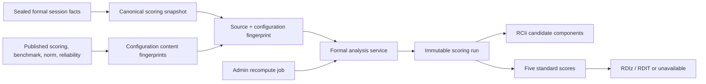

# Stage 10B Analysis Parameters and Recalculation Design

> Status: approved design for review; implementation is intentionally not started.
>
> Branch: `feature/cloudflare-d1-backend`
>
> Baseline commit: `ddda2daca48bac649adbfab5dfac4b7f76204924`

## Goal

Add versioned, administrator-only analysis configuration for expert benchmarks,
norms, reliability and RDI 2.0 scoring definitions. The system must calculate
candidate-level RCIi and session-level RDIz/RDIT from sealed formal-session
facts, and support resumable, idempotent historical recalculation without
changing any session version or exposing analysis results to participants.

## Scope and explicit exclusions

Stage 10B adds only administrator configuration and analysis execution. It
does not add resilience levels, percentiles, participant or identity search,
CSV/JSON/ZIP export, permanent deletion, multi-administrator roles, background
schedulers, a public scoring API, deployment, or a participant-facing report.
Quick mode remains a local MVP report and never reads or writes analysis
configuration, jobs, runs or metrics. Formal completion and resume responses
continue to expose no benchmark, norm, reliability, RCI, RDIz or RDIT values.

## Chosen architecture

The existing `prepilotScoring.ts` remains the Stage 8 orchestrator and keeps
its current semantics: it creates research-only prepilot runs and explicitly
does not accept norm or reliability parameters. Stage 10B adds a separate
formal-analysis orchestrator and a separate recomputation-job service. The two
orchestrators reuse narrow, database-independent formula helpers and the
existing sealed-input reader/fingerprint primitives where their contracts are
compatible, but neither changes the other service's published behavior.

This separation prevents a published analysis configuration from changing how
prepilot runs are interpreted. It also allows a failed Stage 10B run to remain
an immutable historical fact without replacing a valid current run.



## Version lifecycle and session binding

Benchmark sets, norm sets, reliability sets and scoring definitions all follow
the same lifecycle:

`draft -> validated -> published -> referenced by configuration set ->
configuration set published -> configuration set activated -> new session
binds versions`.

Drafts may be edited with an optimistic `expectedRevision`. Every successful
edit increments `revision_no`, sets validation to `stale`, and clears the
content fingerprint. Validation writes a separate immutable validation-history
row. Publication requires a current valid validation row with the same revision
and content fingerprint. Published objects are immutable at the API and D1
trigger boundaries; there is no published-delete API.

Activation is separate from publication. Activating a configuration set only
changes which published set new sessions copy. It never alters a historical
session's `scoring_version`, `benchmark_version`, `norm_version` or
`reliability_version`. Automatic scoring uses those session-bound versions.
Administrator recomputation instead names an explicit published target tuple;
that tuple is stored in the job and each resulting run, without modifying the
session.

## Migration 0013

`migrations/0013_analysis_configuration_recompute.sql` will be forward-only and
advance `app_metadata.schema_version` from `10` to `11`. It will not seed any
expert score, formal benchmark, norm value, reliability value, scoring
definition, job, analysis run, administrator or session. If a post-application
integrity repair is required, it will use `0014` or later and will leave the
schema version at `11`.

The migration will add the following durable facts.

| Object | Purpose | Important invariants |
| --- | --- | --- |
| `benchmark_candidate_policies` | A-E directions and core-EAC inclusion per benchmark | Exactly five rows for a publishable benchmark; A/C `-1`, B/D `1`, E `0` and excluded for the initial policy backfill |
| `analysis_validation_runs` | Immutable validation history for all four analysis object types | Valid JSON error/warning arrays, target revision, fingerprint, safe request and admin references |
| `derived_metric_standard_scores` | Per-run RES/EACS/DDS/GDS/SLS raw value, norm mean/SD, z and weighted contribution | One row per metric/run, no participant identity |
| `scoring_recompute_jobs` | Explicit target tuple and frozen candidate session set | No identity fields; state and counters are server-managed |
| `scoring_recompute_items` | One session work item per job | Stable order, `pending/processing/completed/partial/failed/reused/skipped`, lease ownership and expiry |

Existing `benchmark_sets`, `norm_sets`, `reliability_parameters` and
`scoring_definitions` gain Stage 10A-style display, source, revision,
validation, fingerprint, administrator and timestamp metadata. `benchmark_expert_scores`
gains revision tracking where needed. `configuration_sets` and `sessions` gain
nullable `reliability_version`; old sessions remain NULL. `derived_metric_values`
accepts `components_calculated` and `calculated` calculation statuses in
addition to its existing unavailable states.

The migration backfills only `benchmark_candidate_policies` for
`benchmark-1.0.0`, preserving its published provisional baseline and existing
values. No provisional baseline value is copied into a new expert benchmark.

## Expert benchmark design

An expert benchmark is created by cloning an existing published benchmark into
a distinct `expert_panel` draft. Clone copies the five policy rows but does not
copy candidate values or expert scores. The draft document replaces the entire
matrix atomically:

```ts
type ExpertBenchmarkDocument = {
  displayName: string
  expectedRevision: number
  ratedAt: string
  candidatePolicies: Array<{
    candidateId: 'A' | 'B' | 'C' | 'D' | 'E'
    direction: -1 | 0 | 1
    includeInCoreEac: boolean
  }>
  experts: Array<{
    expertCode: string
    scores: Record<'A' | 'B' | 'C' | 'D' | 'E', number>
  }>
}
```

The request cannot contain submitted mean, SD or expert-count fields. The
server replaces all draft policy and score rows in one transaction only after
validating the complete document. One expert must score every candidate exactly
once; there are no partial-matrix writes. Every score is a finite value in
`[0, 100]`, including endpoints 0 and 100.

`expertCode` is research-internal only: 3-64 characters from letters, digits,
dot, hyphen and underscore. Chinese characters, whitespace, `@`, e-mail
patterns, mobile-number patterns and WeChat-like identifiers are rejected.
Codes that match a conservative Latin personal-name/pinyin pattern are accepted
but produce `EXPERT_CODE_REQUIRES_ANONYMITY_REVIEW`. The UI repeats that only
anonymous research codes may be used. Neither audit logs nor idempotency
receipts contain the complete matrix.

Validation requires `source_type=expert_panel`, a valid date, five complete
policies, at least two distinct experts, and a complete A-E score matrix. It
adds a non-blocking `EXPERT_PANEL_SIZE_REQUIRES_REVIEW` warning when the panel
is technically publishable but small. Publishing reruns validation and computes
the five candidate means and sample standard deviations using `n - 1`:

`mean = sum(scores) / n`

`sampleSD = sqrt(sum((score - mean)^2) / (n - 1))`

The transaction writes the immutable candidate values, accurate distinct
`expert_count`, `rated_at`, `is_provisional=0`, audit row and operation receipt.
Published expert data cannot be changed or deleted.

## Norm, reliability and scoring-definition design

Norm drafts reference a published scoring definition and contain exactly
`RES`, `EACS`, `DDS`, `GDS`, `SLS`; each has a finite mean and positive SD.
Publication also requires `sample_size >= 2` and a non-empty population note.
The existing `norm-prepilot-draft` stays draft and cannot be selected as a
published norm. No current scoring run is aggregated to fabricate norms.

Reliability remains a single-row version for metric `EAC`. It references a
published scoring definition and requires finite `sd_value > 0`,
`0 < reliability_value <= 1`, `sample_size >= 2` and a population note. There
is no fallback SD or reliability value.

Scoring definitions expose only a typed RDI 2.0 object. They reject code,
SQL, unknown keys, level thresholds and percentile rules. The valid structure
fixes `formulaFamily='RDI-2.0'`, `timeUnit='second'`, complete five weights that
sum to one within a documented floating-point tolerance, available-case EAC and
EACS aggregation, earliest-key-risk policy, strict complete-case missing policy,
and the fixed SLS mapping. `levelEnabled` is permanently false in this stage;
`totalRdiEnabled` may be true or false.

## Configuration compatibility

A Stage 10B configuration set refers to one published scoring definition,
benchmark, norm (optional only when total RDI is disabled) and reliability
(optional, with a warning that RCIi will be unavailable). Validation rejects a
draft or retired reference, a scoring/norm mismatch, a scoring/reliability
mismatch, or `totalRdiEnabled=true` with no norm. It warns for a provisional
benchmark and missing reliability. Published configuration and activation
remain separate Stage 10A operations.

## Fingerprints and immutable scoring runs

The formal-analysis run fingerprint is SHA-256 over canonical JSON containing:

- the privacy-minimized, sealed session facts already used by scoring input;
- the effective session or job target version tuple;
- each of the scoring, benchmark, norm and reliability content fingerprints;
- the stable formula-relevant policy and parameter facts.

Version IDs alone are insufficient. Any sealed source-fact change or any
referenced content/policy/parameter change creates a different fingerprint.
Identical session, tuple and fingerprint reuse the existing immutable run.
Historical runs are append-only. A successful new run atomically clears the
previous current-run flag only after all artifacts persist; a failed run is
preserved but cannot replace a successful current run.

## Calculation contract

Pure formula helpers take typed, database-free inputs. The formal orchestrator
loads only published configuration and sealed facts, then persists results.

For every candidate with a valid EACi and published EAC reliability:

`SEM = reliabilitySD * sqrt(1 - r)`

`Sdiff = sqrt(2) * SEM`

`RCIi = EACi / Sdiff`

E remains `excluded_direction_zero`. Missing EACi stays unavailable. There is
no overall RCI aggregation: the aggregate RCI metric has `numeric_value=NULL`,
status `components_calculated`, and an input record containing only the count
of valid candidate components. RCI is not a weighted RDI component.

For a published norm, the service creates five standard-score rows:

`z = (rawValue - normMean) / normSD`

`weighted = z * configuredWeight`

RDI is strict complete-case. If any of RES, EACS, DDS, GDS or SLS is missing,
unavailable, non-finite or lacks an allowed norm parameter, all RDIz/RDIT
numeric fields remain NULL with an explicit missing reason. Missing values are
never converted to zero or mean-imputed. When all five exist:

`RDIz = sum(weighted)`

`RDIT = 50 + 10 * RDIz`

RDIT is not silently clamped. No level or percentile artifact is produced.

## Recalculation jobs

Creating a job requires an authenticated administrator, CSRF, same-origin,
UUID idempotency key and an explicit published target tuple. The service freezes
all eligible completed/timeout sessions at creation into one item per session;
in-progress sessions and sessions without a completion record are omitted. The
job itself does not contain participant identity.

`run-next` accepts `batchSize` 1-25. It claims pending items in stable session
order using a conditional update that changes a row from `pending` (or expired
`processing`) to `processing`, records a random lease token and a finite lease
expiry. The worker only completes an item when its token still matches. An
interrupted request leaves the item recoverable once the lease expires. A
per-item transaction creates or reuses a run and stores a final item result;
one failed item does not block later items. Counters are recomputed from item
states so retry and refresh cannot drift them. The job ends as `completed` or
`completed_with_failures` only when no claimable items remain. There is no
automatic loop or scheduler.

## Administrator API and UI

New protected `/api/admin/analysis/*` endpoints cover list, clone, get, full
draft replacement, validate and publish for benchmarks, norms, reliability and
scoring definitions; job create/list/get and `run-next`; and read-only analysis
configuration/job projections. Every write uses the existing Stage 10A request
guard, CSRF/origin validation, maximum body size, unknown-field rejection,
expected revision checks, operation receipts and safe errors with a request ID.

The admin console gains an Analysis tab with four typed editors and a recompute
jobs panel. Editors are read-only for published objects, show server validation
and warnings, never render arbitrary code, and display the publish target ID in
the confirmation. The expert editor presents an A-E matrix and an explicit
anonymous-code notice. Job views display only job/session IDs and safe statuses,
never names, student IDs or phones. It has no export or delete control.

## Participant and browser isolation

The participant router gains no analysis endpoint. Completion and resume DTOs
remain analysis-free. Formal pages retain their neutral completion screen, and
Quick retains its local report. The browser stores neither expert matrices nor
norm/reliability parameters. Only authenticated administrator API responses may
contain configuration details.

## Test and verification strategy

Implementation uses red-green TDD. Worker tests will first cover migration 0013,
each draft lifecycle, validation failures, publication calculations, immutable
triggers, configuration compatibility, fingerprint identity, RCI/RDI formulas,
strict missing values, job lease/retry behavior, idempotency, auditing and
participant isolation. Frontend tests will cover the analysis-tab boundaries,
typed editor validation, read-only published state, job controls and absence of
participant identity/metric views. Existing 358 Worker and 164 frontend tests
remain regression gates.

Local verification will use isolated Miniflare tests plus a cleaned local D1
synthetic scenario: publish synthetic analysis versions, run batches, test
reuse/failure/rollback, then delete synthetic local business facts and restore
`config-2026-07-v1`. Remote 0013 runs only after every local gate passes and
only if remote administrator, participant and session tables remain empty. It
writes schema only plus the initial policy backfill; it writes no synthetic
analysis value or job. No Worker deployment, remote push, merge or pull request
is part of this stage.

## Rollback and failure behavior

Database migrations are forward-only. Operational rollback means reactivate a
previous published configuration set; it does not rewrite sessions, runs or
published analysis versions. A failed validation blocks publication. A failed
analysis item stores a safe failure result and leaves prior current runs intact.
An expired lease permits a later `run-next` call to recover unfinished work.

## Design self-review

- No requirement relies on fabricated expert, norm or reliability data.
- Session-fixed automatic scoring and explicit-target administrative recompute
  are separate, and neither rewrites session versions.
- Stage 8 behavior remains isolated behind its existing prepilot orchestrator.
- The fingerprint includes sealed facts and four configuration content
  fingerprints, not only version IDs.
- RCI is candidate-level only; RDI uses strict complete-case and produces no
  level or percentile.
- Published versions, validation history, scoring runs and job facts are
  append-only or immutable as appropriate.
- Recompute work uses conditional claims and expiring leases instead of a
  background loop.
- Formal and Quick participants remain isolated from analysis configuration and
  output.
- Stage 11 remains responsible for participant queries and CSV/ZIP export.
